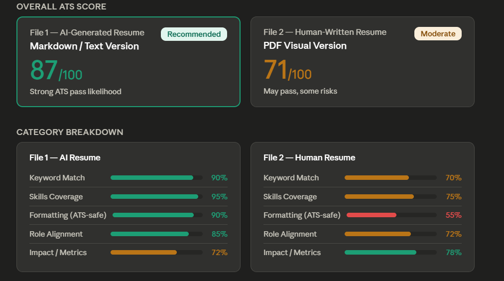

<div align="center">

# ⚡ ResumeForge - OPENSOURCE

### A modular MCP server that turns your career data into structured Markdown — and tailors it to any job description for maximum ATS score.

[](https://github.com/vijayakanth06/ResumeForge/actions)
[](https://python.org)
[](LICENSE)
[](https://github.com/vijayakanth06/ResumeForge)
[](CONTRIBUTING.md)

**[📖 How It Works](#how-it-works) · [🚀 Quick Start](#quick-start) · [🔧 Tools](#tools) · [🔌 MCP Client Setup](#mcp-client-setup) · [🤝 Contributing](CONTRIBUTING.md)**

</div>

---

## What Is ResumeForge?

ResumeForge is a **plug-and-play MCP (Model Context Protocol) server** with five specialized tools. Four tools extract your career data from different sources into Markdown. The fifth tool combines all that data and tailors it to any job description for maximum ATS compatibility.

| # | Source | Tool | What It Produces |
|---|---|---|---|
| 1 | 🔗 **LinkedIn** | `linkedin_ingest_archive` | 7 Markdown files: identity, summary, experience, education, skills, certifications, projects |
| 2 | 🐙 **GitHub** | `github_build_profile` | Per-repo Markdown + portfolio summary from public & private repos |
| 3 | 💻 **Coding Platforms** | `coding_extract_profiles` | Stats from LeetCode & Codeforces — rating, problems, contests |
| 4 | 📄 **Resume Files** | `resume_history_analyze` | Career timeline from multiple PDF/DOCX resumes |
| 5 | 🎯 **ATS Tailor** | `tailor_resume_for_job` | ATS-optimized resume tailored to a specific job description |

**One `.env` file configures everything. One `server.py` runs everything.**

Connect ResumeForge to Claude Desktop, Cursor, or any MCP-compatible client and call the tools directly in your AI chat.

---

## 📈 Why ResumeForge? (The ATS Advantage)

Writing resumes manually takes hours, and modern **Applicant Tracking Systems (ATS)** heavily penalize human formatting errors. We tested a human-crafted resume against a **ResumeForge AI-Tailored** resume using standard ATS scoring metrics. 

Here is why the `tailor_mcp` tool is a game-changer for your job hunt:

<div align="center">
  
  <p><em>Real ATS parsing comparison demonstrating the ResumeForge advantage.</em></p>
</div>

### 🔍 The Core Issues ResumeForge Solves

| 🛑 The "Human Resume" Problem | ✅ The ResumeForge Solution |
| :--- | :--- |
| **Garbled Parsing:** Two-column PDFs are read left-to-right linearly by ATS, mixing skills and experience text together into complete gibberish. | **100% Parsing Accuracy:** Generates clean, single-column plain-text Markdown that ATS systems parse flawlessly. |
| **Missing Context:** Listing "Flask" in a skills section isn't enough; ATS parsers weight keywords heavily when found inside bullet points. | **Contextual Keyword Injection:** The AI automatically rewrites your bullet points to organically include JD keywords (e.g., *FastAPI, HTTP concepts*). |
| **Time Consuming:** Manually rewriting projects and bullet points for every single job application takes 1-2 hours per company. | **Seconds, not Hours:** Instantly queries your entire career database (`md/`) and generates a perfect match in seconds. |

By using the `tailor_resume_for_job` tool, you ensure dense keyword coverage and a structure that recruitment software actually understands, massively increasing your interview callback rate.

---

## How It Works

```
Your Data Sources              ResumeForge MCP Tools           Output
─────────────────              ─────────────────────           ──────

PHASE 1: Extract career data into md/

LinkedIn Export       ──────►  linkedin_ingest_archive   ──►  md/linkedin/*.md
GitHub Profile        ──────►  github_build_profile      ──►  md/github/**/*.md
LeetCode / Codeforces ──────►  coding_extract_profiles   ──►  md/coding/*.md
Resume Folder (PDF)   ──────►  resume_history_analyze    ──►  md/resume/*.md

PHASE 2: Tailor for a specific job

md/ + Job Description ──────►  tailor_resume_for_job     ──►  md/tailored/<Company>_<Role>.md
                                        │
                               ─────────┼──────────────────────────────────
                               ATS-optimized resume ready for any AI resume builder
```

---

## Quick Start

### 1. Clone & Install

```bash
git clone https://github.com/vijayakanth06/ResumeForge.git
cd ResumeForge
pip install -r requirements.txt
```

### 2. Configure

```bash
cp .env.example .env
```

Open `.env` and fill in your details:

```env
# 1. LinkedIn — path to your extracted data export folder
LINKEDIN_ARCHIVE_PATH=/path/to/LinkedInExport

# 2. GitHub — profile URL + token for private repo access
GITHUB_PROFILE=https://github.com/your-username
GITHUB_TOKEN=ghp_your_classic_token_here

# 3. Coding — comma-separated profile URLs
CODING_PROFILES=https://leetcode.com/u/your-user, https://codeforces.com/profile/your-user

# 4. Resume folder — folder containing your PDF/DOCX resume files
RESUME_HISTORY_PATH=/path/to/your/resumes

# 5. (Optional) Default JD file or folder for the tailor tool
JD_INPUT_PATH=/path/to/job_descriptions/role.txt
```

> **Note:** All fields are optional. Each tool only uses its own config key.

### 3. Run

```bash
python server.py
```

---

## Tools

### `linkedin_ingest_archive`

Parses your official [LinkedIn Data Export](https://www.linkedin.com/mypreferences/d/download-my-data) into 7 clean Markdown files.

```python
# Zero-config — reads LINKEDIN_ARCHIVE_PATH from .env
linkedin_ingest_archive()

# Or pass the path explicitly
linkedin_ingest_archive(folder_path="/path/to/LinkedInExport")
```

**Output:** `md/linkedin/` → `identity.md`, `summary.md`, `experience.md`, `education.md`, `skills.md`, `certifications.md`, `projects.md`

---

### `github_build_profile`

Discovers your repositories via GitHub GraphQL + REST API, scores them by resume relevance, and writes per-repo Markdown.

```python
# Zero-config — reads GITHUB_PROFILE + GITHUB_TOKEN from .env
github_build_profile()

# Pass profile URL directly
github_build_profile(github_profile="https://github.com/your-username")

# With rich project context for better output
github_build_profile(
    github_profile="https://github.com/your-username",
    repo_names=["project-a", "project-b"],
    project_context={
        "project-a": {
            "problem": "What problem it solves",
            "role": "My specific role",
            "impact": "Measurable outcome",
            "technologies": "Python, FastAPI, PostgreSQL",
        }
    }
)
```

**Token modes:**
- `GITHUB_TOKEN` set (Classic token, `repo` scope) → public + private repos via GraphQL (5,000 req/hr)
- No token → public repos only via REST (60 req/hr)

**Output:** `md/github/projects/<repo>.md` + `md/github/projects_summary.md`

---

### `coding_extract_profiles`

Pulls your competitive programming stats directly from platform APIs.

```python
# Zero-config — reads CODING_PROFILES from .env
coding_extract_profiles()

# Pass URLs directly
coding_extract_profiles("https://leetcode.com/u/user, https://codeforces.com/profile/user")

# Or use shorthand
coding_extract_profiles("leetcode: user, codeforces: user")
```

| Platform | API Method | Data Extracted |
|---|---|---|
| LeetCode | GraphQL API | Problems solved, difficulty breakdown, rating, rank, badges, contests |
| Codeforces | Official REST | Current rating, max rating, rank title, contest count |

**Output:** `md/coding/leetcode.md`, `md/coding/codeforces.md`, `md/coding/summary.md`

---

### `resume_history_analyze`

Ingests a folder of past resume versions (PDF + DOCX), extracts all data, and returns it to the host LLM for perfect structuring. The host LLM deduplicates and formats the career timeline.

```python
# Zero-config — reads RESUME_HISTORY_PATH from .env
resume_history_analyze()

# Or pass folder directly
resume_history_analyze(folder_path="/path/to/resumes")
```

**Pipeline:**
1. **Discovery** — scans folder, sorts files by `mtime` (oldest → newest)
2. **Extraction** — `pdfplumber` primary, `PyMuPDF` fallback, `python-docx` for DOCX
3. **Lenient mode** — unclassified sections preserved raw for LLM enrichment
4. **Classification** — detects generic vs company-targeted resumes
5. **Aggregation** — oldest-to-newest merge, latest resume wins conflicts
6. **Deduplication** — fuzzy match (rapidfuzz) for projects/jobs, exact for skills/certs
7. **LLM Handoff** — returns raw data to your host AI for perfect formatting

**Output:** `md/resume/resume_history.md` (generated by your host LLM)

---

### `tailor_resume_for_job` ⭐ NEW

The culmination tool. It reads **all** generated Markdown files from `md/` (output of the 4 tools above) and combines them with a Job Description. It then instructs your host LLM to generate a perfectly ATS-optimized resume.

#### Input Methods

You can provide the Job Description in **any** of these ways:

| Method | Parameter | Example |
|---|---|---|
| **Paste text** | `job_description_text` | `"We are looking for a Backend Engineer..."` |
| **Single file** | `job_description_file` | `"/path/to/role.txt"` or `"/path/to/jd.pdf"` |
| **Folder of files** | `job_description_folder` | `"/path/to/jd_folder/"` (reads all TXT/PDF/DOCX inside) |
| **`.env` default** | `JD_INPUT_PATH` | Auto-reads when no arguments are provided |

Supported file types: `.txt`, `.md`, `.pdf`, `.docx`

#### Usage

```python
# Method 1: Paste the JD directly
tailor_resume_for_job(
    job_description_text="We are looking for a Machine Learning Engineer at Google..."
)

# Method 2: Point to a JD file
tailor_resume_for_job(
    job_description_file="/path/to/google_ml_engineer.txt"
)

# Method 3: Point to a folder of JD documents
tailor_resume_for_job(
    job_description_folder="/path/to/job_descriptions/"
)

# Method 4: Zero-config — reads JD_INPUT_PATH from .env
tailor_resume_for_job()

# Mix text + file for extra context
tailor_resume_for_job(
    job_description_text="Additional notes: focus on NLP experience",
    job_description_file="/path/to/jd.pdf"
)
```

#### What Stays Static (copied exactly)
- ✅ Name, email, phone, LinkedIn, GitHub, portfolio
- ✅ Education — degree, university, CGPA
- ✅ Certifications & Awards

#### What Gets Tailored (by your LLM)
- 🎯 Professional Summary — rewritten for the specific role
- 🎯 Skills — selected and grouped to match JD keywords
- 🎯 Experience — bullet points rewritten to align with JD
- 🎯 Projects — top relevant projects selected with matching tech stacks
- 🎯 Area of Interest — aligned with the JD domain

**Output:** `md/tailored/<CompanyName>_<JobTitle>.md`

---

## Output Structure

```
md/
├── linkedin/                    ← linkedin_ingest_archive
│   ├── identity.md
│   ├── summary.md
│   ├── experience.md
│   ├── education.md
│   ├── skills.md
│   ├── certifications.md
│   └── projects.md
│
├── github/                      ← github_build_profile
│   ├── projects/
│   │   └── <repo-name>.md
│   └── projects_summary.md
│
├── coding/                      ← coding_extract_profiles
│   ├── leetcode.md
│   ├── codeforces.md
│   └── summary.md
│
├── resume/                      ← resume_history_analyze
│   └── resume_history.md
│
└── tailored/                    ← tailor_resume_for_job
    ├── Google_MLEngineer.md
    ├── Microsoft_BackendDev.md
    └── ...
```

> **Note:** The `md/` directory is git-ignored. It contains your personal career data and is regenerated on each run.

---

## MCP Client Setup

### Claude Desktop

Edit `~/Library/Application Support/Claude/claude_desktop_config.json` (macOS) or  
`%APPDATA%\Claude\claude_desktop_config.json` (Windows):

```json
{
  "mcpServers": {
    "resumeforge": {
      "command": "python",
      "args": ["server.py"],
      "cwd": "/absolute/path/to/ResumeForge"
    }
  }
}
```

### Cursor / VS Code

Go to **Settings → MCP → Add Server**:

```json
{
  "mcpServers": {
    "resumeforge": {
      "command": "python",
      "args": ["server.py"],
      "cwd": "/absolute/path/to/ResumeForge"
    }
  }
}
```

### With Conda

```json
{
  "mcpServers": {
    "resumeforge": {
      "command": "C:\\Users\\you\\miniconda3\\envs\\your-env\\python.exe",
      "args": ["server.py"],
      "cwd": "/absolute/path/to/ResumeForge"
    }
  }
}
```

> **Tip:** Use the full Python path instead of `conda run` to avoid stdio corruption.

---

## Architecture

Each data source is a fully self-contained module. Adding a new source means creating a new `*_mcp/` package — zero changes to existing code.

```
ResumeForge/
├── server.py              # Central MCP server — single entry point (5 tools)
├── env_loader.py          # Shared .env reader — used by all tools
├── .env.example           # Config template
│
├── linkedin_mcp/          # Tool 1: LinkedIn archive
│   ├── tool.py            #   linkedin_ingest_archive()
│   ├── parser.py          #   CSV discovery + parsing
│   ├── markdown_writer.py #   Markdown generation
│   ├── config.py          #   File mappings, section categories
│   ├── prompts.py         #   Markdown templates
│   ├── schemas.py         #   Typed dataclasses
│   ├── exceptions.py      #   Custom error hierarchy
│   └── utils.py           #   Helpers
│
├── github_mcp/            # Tool 2: GitHub projects
│   ├── tool.py            #   github_build_profile()
│   ├── api.py             #   GraphQL + REST client
│   ├── analyzer.py        #   Tech stack inference + relevance scoring
│   ├── markdown_writer.py
│   ├── config.py
│   ├── prompts.py
│   ├── schemas.py
│   └── exceptions.py
│
├── coding_mcp/            # Tool 3: Coding platforms
│   ├── tool.py            #   coding_extract_profiles()
│   ├── api.py             #   LeetCode GraphQL + Codeforces REST
│   ├── markdown_writer.py
│   ├── config.py
│   ├── prompts.py
│   ├── schemas.py
│   └── exceptions.py
│
├── resume_mcp/            # Tool 4: Resume history analysis
│   ├── tool.py            #   resume_history_analyze()
│   ├── extractor.py       #   pdfplumber → PyMuPDF fallback + DOCX
│   ├── classifier.py      #   generic vs company-specific
│   ├── aggregator.py
│   ├── deduplicator.py
│   ├── timeline.py
│   ├── markdown_writer.py
│   ├── prompts.py
│   ├── schemas.py
│   ├── config.py
│   └── exceptions.py
│
├── tailor_mcp/            # Tool 5: ATS resume tailor
│   ├── tool.py            #   tailor_resume_for_job()
│   ├── reader.py          #   md/ aggregator + JD parser (TXT/PDF/DOCX)
│   ├── prompts.py         #   LLM system instructions for ATS optimization
│   ├── config.py          #   Constants and paths
│   └── exceptions.py      #   Custom error hierarchy
│
└── .github/
    ├── workflows/ci.yml
    ├── ISSUE_TEMPLATE/
    └── PULL_REQUEST_TEMPLATE.md
```

---

## Extending ResumeForge

### Add a new MCP tool module

1. Create `new_source_mcp/` with `tool.py`, `config.py`, `exceptions.py`
2. Implement `new_source_extract(input: str | None = None) -> dict`
3. Register in `server.py`:
   ```python
   from new_source_mcp.tool import new_source_extract
   mcp.tool()(new_source_extract)
   ```
4. Add config key to `.env.example`

### Add a new coding platform

1. Add URL regex to `coding_mcp/config.py` → `PLATFORM_PATTERNS`
2. Write `fetch_<platform>(username)` in `coding_mcp/api.py`
3. Register in `PLATFORM_FETCHERS` dict

---

## Requirements

| Dependency | Purpose |
|---|---|
| `mcp[cli] >= 1.2.0` | FastMCP server SDK |
| `pandas >= 2.0.0` | LinkedIn CSV parsing |
| `httpx >= 0.27.0` | Async HTTP client (GitHub + coding APIs) |
| `pdfplumber >= 0.11.0` | PDF text extraction (primary) |
| `PyMuPDF >= 1.24.0` | PDF extraction fallback |
| `python-docx >= 1.1.0` | DOCX extraction |
| `python-dateutil >= 2.9.0` | Smart date parsing |
| `rapidfuzz >= 3.6.0` | Fuzzy string matching for deduplication |

**Python 3.10+ required.**

---

## Contributing

Contributions are welcome! See [CONTRIBUTING.md](CONTRIBUTING.md) for setup instructions, coding standards, and how to add new platforms or tools.

Please read our [Code of Conduct](CODE_OF_CONDUCT.md) before participating.

---

## Changelog

See [CHANGELOG.md](CHANGELOG.md) for a full history of releases.

---

## License

MIT — see [LICENSE](LICENSE) for details.
